# 项目名称
基于java+maven+ssm+mysql+个人博客项目（期末大作业，毕业设计）
java个人博客项目，jsp个人博客项目，mysql个人博客项目

## 特性/功能

基于java+maven+ssm+mysql+个人博客项目（期末大作业，毕业设计）

期末大作业，毕业设计

mvc 模式   

具体功能如下截图：
  登录，注册，博客分类，评论，收藏，个人信息修改，留言，文章统计，标签管理【增删改查】，关于本站，博客管理【增删改查】，评论管理【增删改查】，菜单管理【增删改查】，用户管理【增删改查】,公告管理【增删改查】，网站信息管理，链接管理
  
## 用户端功能以及截图
### 1.首页
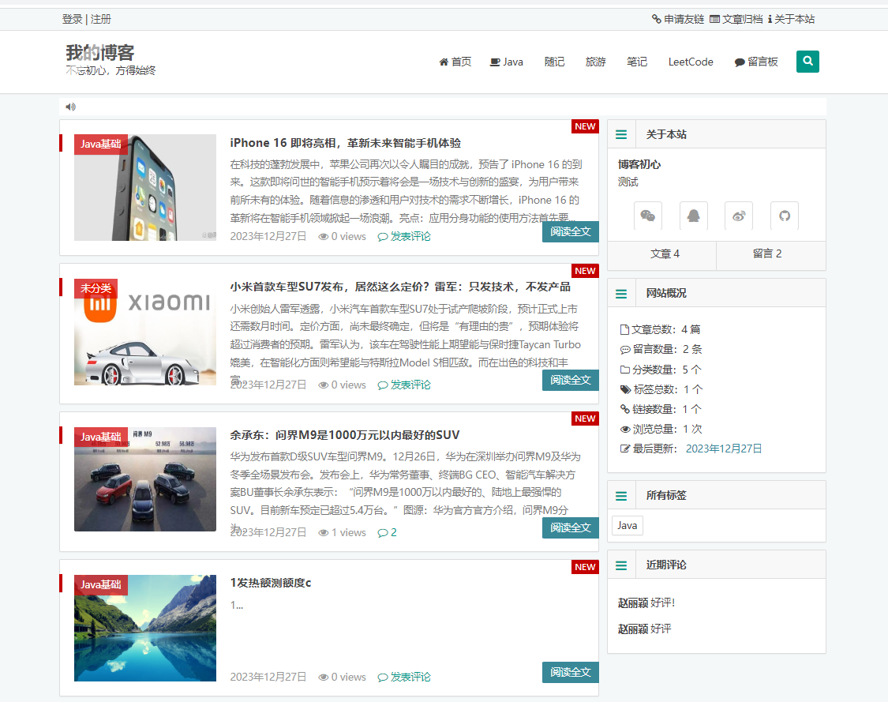

### 2.登录                
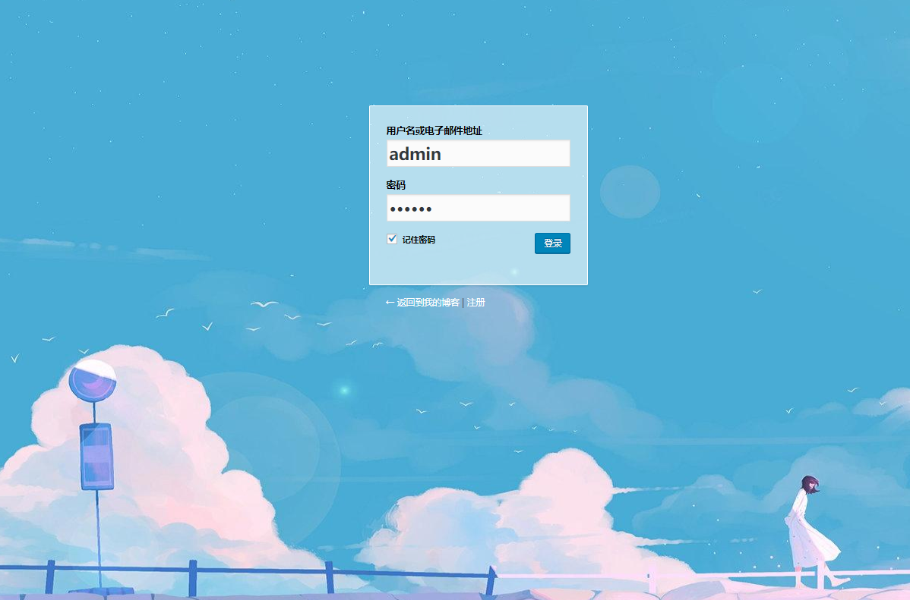

### 3.注册          
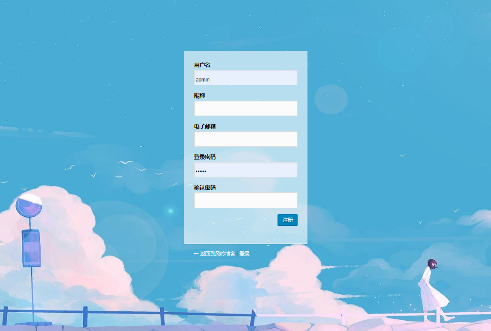

###4.博客详情          
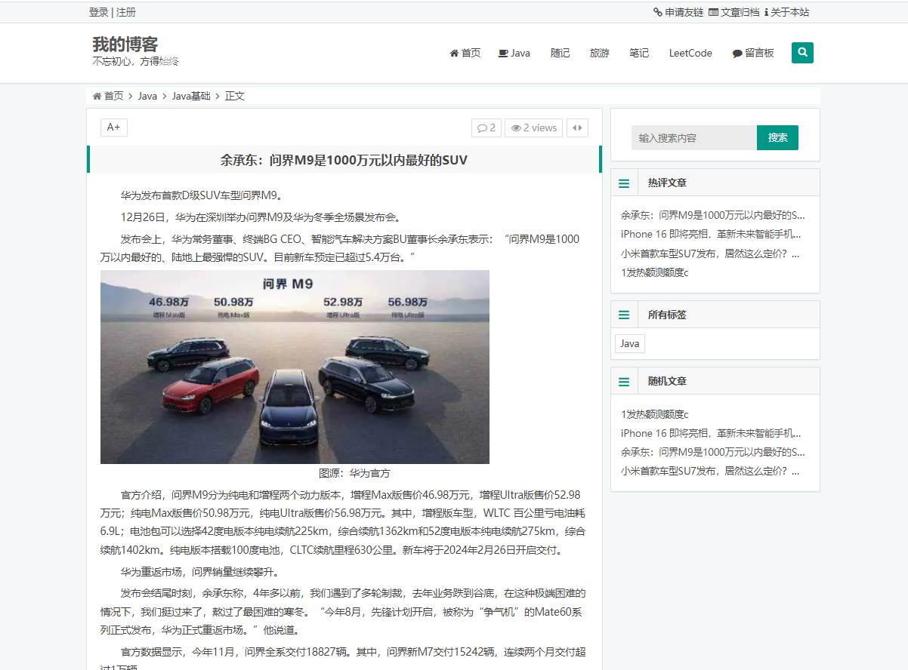

###5.博客评论          
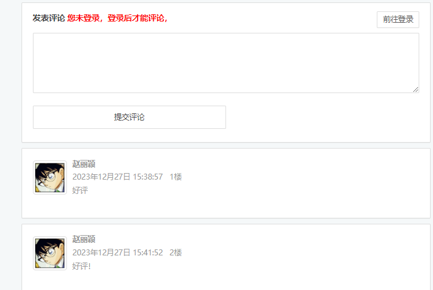

###6.发表博客          
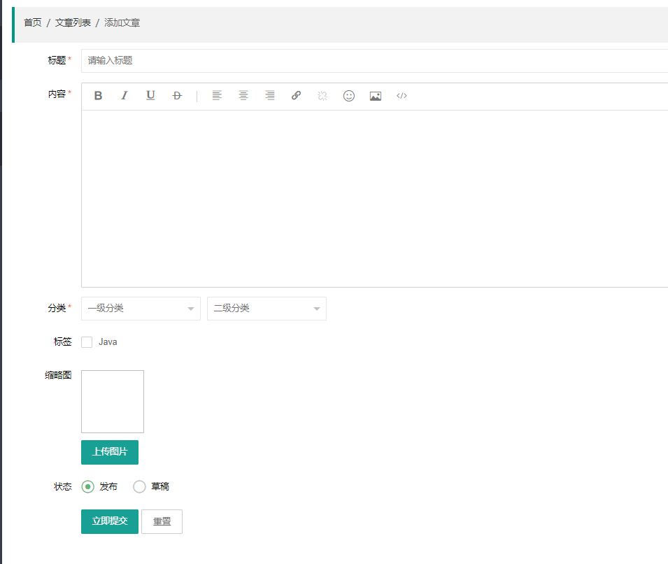

## 用户端功能以及截图

### 1.管理登录

### 2.博客管理首页
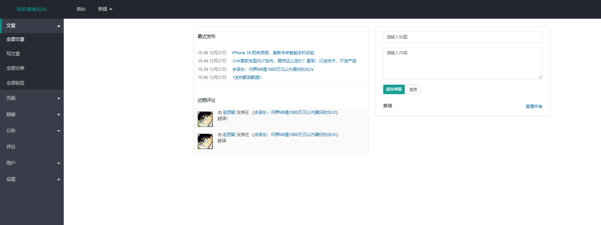

### 2.博客管理【增删改查】

### 3.用户管理【增删改查】
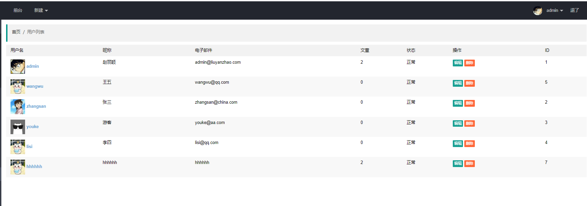

### 4.分类管理【增删改查】
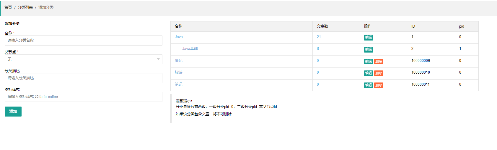

### 5.标签管理【增删改查】
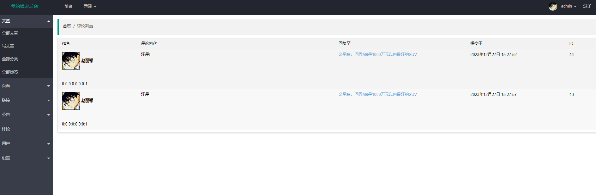

### 6.评论管理【增删改查】

### 7.链接管理【增删改查】

### 8.公告管理【增删改查】
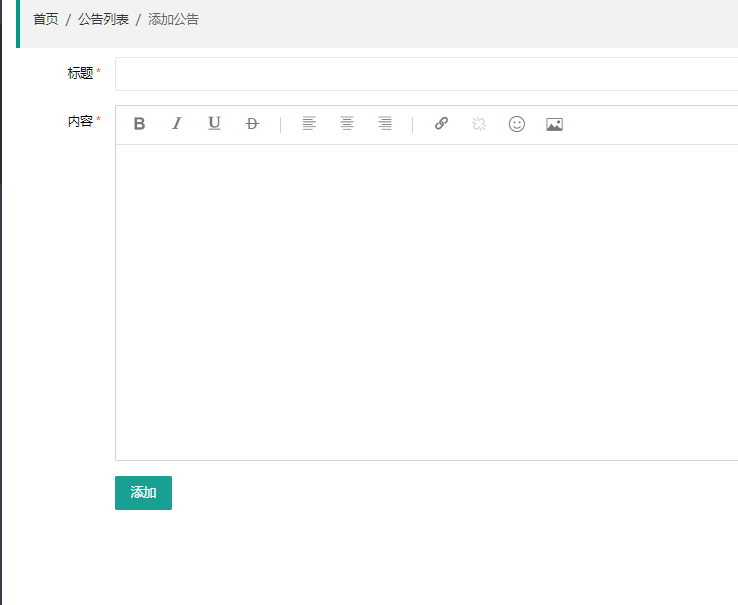

### 9.基本信息管理
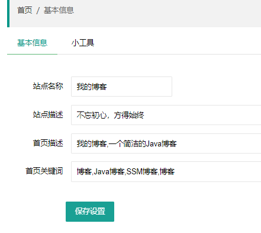

## 安装与下载
### 加QQ：2108657327 免费获取项目源代码！！！        

